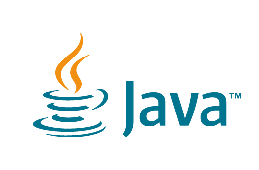

   <p align="center">
  
  <h2 align="center"> </h2>
</p>

# Java - Overview
Java programming language was originally developed by Sun Microsystems which was initiated by James Gosling and released in 1995 as core component of Sun Microsystems' Java platform

Java is −

*Object Oriented − In Java, everything is an Object. Java can be easily extended since it is based on the Object model.

*Platform Independent − Unlike many other programming languages including C and C++, when Java is compiled, it is not compiled into platform specific machine, rather into platform independent byte code. This byte code is distributed over the web and interpreted by the Virtual Machine (JVM) on whichever platform it is being run on.

*Simple − Java is designed to be easy to learn. If you understand the basic concept of OOP Java, it would be easy to master.

*Secure − With Java's secure feature it enables to develop virus-free, tamper-free systems. Authentication techniques are based on public-key encryption.

*Architecture-neutral − Java compiler generates an architecture-neutral object file format, which makes the compiled code executable on many processors, with the presence of Java runtime system.

*Portable − Being architecture-neutral and having no implementation dependent aspects of the specification makes Java portable. Compiler in Java is written in ANSI C with a clean portability boundary, which is a POSIX subset.

*Robust − Java makes an effort to eliminate error prone situations by emphasizing mainly on compile time error checking and runtime checking.

*Multithreaded − With Java's multithreaded feature it is possible to write programs that can perform many tasks simultaneously. This design feature allows the developers to construct interactive applications that can run smoothly.

*Interpreted − Java byte code is translated on the fly to native machine instructions and is not stored anywhere. The development process is more rapid and analytical since the linking is an incremental and light-weight process.

*High Performance − With the use of Just-In-Time compilers, Java enables high performance.

*Distributed − Java is designed for the distributed environment of the internet.

*Dynamic − Java is considered to be more dynamic than C or C++ since it is designed to adapt to an evolving environment. Java programs can carry extensive amount of run-time information that can be used to verify and resolve accesses to objects on run-time.

## Local Environment Setup
Java SE is freely available from the link Download Java. You can download a version based on your operating system.

Follow the instructions to download Java and run the .exe to install Java on your machine. Once you installed Java on your machine, you will need to set environment variables to point to correct installation directories −

#### Setting Up the Path for Windows
Assuming you have installed Java in c:\Program Files\java\jdk directory −

i)Right-click on 'My Computer' and select 'Properties'.

ii)Click the 'Environment variables' button under the 'Advanced' tab.

iii)Now, alter the 'Path' variable so that it also contains the path to the Java executable. Example, if the path is currently set to 'C:\WINDOWS\SYSTEM32', then change your path to read 'C:\WINDOWS\SYSTEM32;c:\Program Files\java\jdk\bin'.

#### Setting Up the Path for Linux, UNIX, Solaris, FreeBSD
Environment variable PATH should be set to point to where the Java binaries have been installed. Refer to your shell documentation, if you have trouble doing this.

Example, if you use bash as your shell, then you would add the following line to the end of your '.bashrc: export PATH = /path/to/java:$PATH'

# Java - Basic Syntax
When we consider a Java program, it can be defined as a collection of objects that communicate via invoking each other's methods. Let us now briefly look into what do class, object, methods, and instance variables mean.

*Object − Objects have states and behaviors. Example: A dog has states - color, name, breed as well as behavior such as wagging their tail, barking, eating. An object is an instance of a class.

*Class − A class can be defined as a template/blueprint that describes the behavior/state that the object of its type supports.

*Methods − A method is basically a behavior. A class can contain many methods. It is in methods where the logics are written, data is manipulated and all the actions are executed.

*Instance Variables − Each object has its unique set of instance variables. An object's state is created by the values assigned to these instance variables.

#### First Java Program
Let us look at a simple code that will print the words Hello World.

Example-

```java
Live Demo
public class MyFirstJavaProgram {

   /* This is my first java program.
    * This will print 'Hello World' as the output
    */

   public static void main(String []args) {
      System.out.println("Hello World"); // prints Hello World
   }
} 
```
Let's look at how to save the file, compile, and run the program. Please follow the subsequent steps −

->Open notepad and add the code as above.

->Save the file as: MyFirstJavaProgram.java.

->Open a command prompt window and go to the directory where you saved the class. Assume it's C:\.

->Type 'javac MyFirstJavaProgram.java' and press enter to compile your code. If there are no errors in your code, the command prompt will take you to the next line (Assumption : The path variable is set).

->Now, type ' java MyFirstJavaProgram ' to run your program.

->You will be able to see ' Hello World ' printed on the window.

Output
``` java
C:\> javac MyFirstJavaProgram.java
C:\> java MyFirstJavaProgram 
Hello World
```
<p align="right">

</p>
